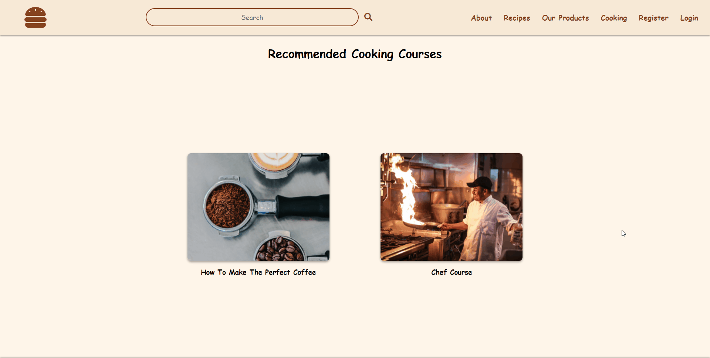

# Tasty Recipes

This is my DJANGO project for [Python Web](https://softuni.bg/modules/75/python-web) course at SoftUni.  

Website for recipes, products and cooking courses. It has custom user functionality, custom admin panel and custom permissions.

### CSS is optimized for 16:9 resolution (1920x1080).

## Home page

### Navigation bar and Footer
When user is not authenticated.

When user is logged in.

## Recipes
This is the main page of the site. It is public and the recipes can be seen by everyone.

The recipes can be filtered by a selected category.

In order to add a recipe, the user must be registered.  
A recipe can be edited or deleted via the 'Edit' and 'Delete' buttons.  
They are shown below the recipe's description area only when the current user is the author of that recipe.

After a recipe is deleted, the user is redirected to 'My recipes' page.

## Profile
When an user is registered, a default profile picture is set and 'My Profile Page' label is shown.  
If the user updates First and Last name from the edit page, 'My Profile Page' is changed with profile's names.

### My Recipes
From this page, the user can see all the recipes that it's author of.  
If the user hasn't added any recipes, a 'Add recipe' button is shown.

When the user deletes his profile, its recipes also gets deleted.

## Products
Public page with products.  
They can only be added, edited and deleted by users with 'Staff' status.

## Cooking Courses
Public page with recomended cooking courses.  
They can only be added, edited and deleted by users with 'Staff' status.

Courses don't have own pages  with details like the recipes and the products.  
Instead, when they are clicked, the user is redirected to the course's link.

## Search
The input is searched in all 3 main_app models - 'Recipe', 'Product' and 'Course'.

## Admin Panel

## Errors 
404

403 and 500

